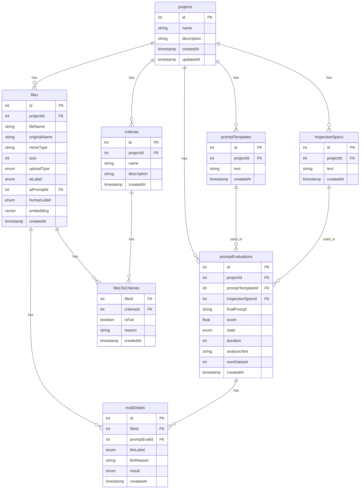

# LLMBox

Zero cloud LLM dependency, 100% local!

## Tech Stack

- local App: [Next.js](https://nextjs.org/)
- local AI: [Ollama](https://ollama.com/)
- local DB: [Postgres](https://www.postgresql.org/)
- local Storage: [Minio](https://min.io/)

## How to run

1. Clone the repository
2. Run `docker compose up -d`
3. Run `pnpm install`
4. Run `pnpm dev`

## Prerequisites

- [Docker](https://www.docker.com/)
- [Ollama](https://ollama.com/)

## Dashboard

- App: [http://localhost:3000/](http://localhost:3000/)
- Minio: [http://localhost:9001/](http://localhost:9001/)

## Development

- DB: [https://local.drizzle.studio/](https://local.drizzle.studio/)
  - Run `pnpm run db:studio` to open the studio

## Entity Relationship Diagram

